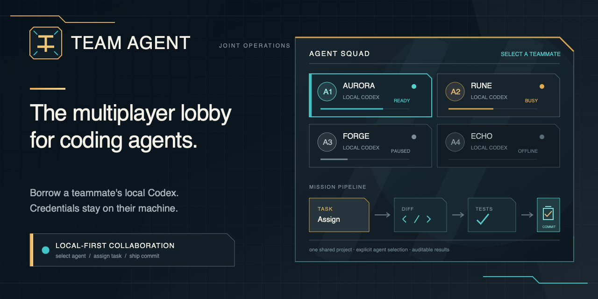
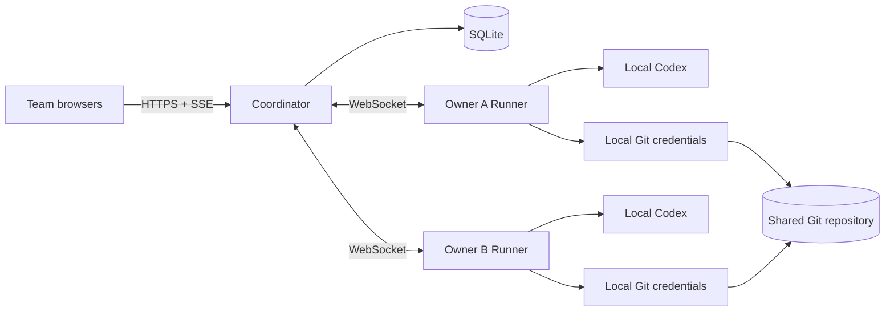

<p align="center">
  
</p>

# Team Agent

**The multiplayer lobby for your team's coding agents.**

Let anyone on your team send coding tasks from a browser—even if they do not
have a local coding agent. They choose a teammate's Codex, follow the work live,
and inspect the response, diff, tests, and commit when it finishes.

**Codex and Git credentials stay on the Agent owner's computer.**

[▶ Open the demo lobby](#open-the-demo-lobby) ·
[🚀 Deploy for your team](#deploy-for-your-team) ·
[⭐ Star Team Agent](https://github.com/boxzeemon-beep/team-agent)

[](https://github.com/boxzeemon-beep/team-agent/actions/workflows/ci.yml)
[](https://github.com/boxzeemon-beep/team-agent/releases/latest)
[](package.json)
[](LICENSE)

[简体中文](README.zh-CN.md) · [Tactical lobby](docs/tactical-lobby-experience.md) · [Architecture](docs/architecture.md) · [Security](SECURITY.md) · [Roadmap](ROADMAP.md) · [Contributing](CONTRIBUTING.md)


**Pick your squad → launch a task → watch it work → review the evidence**

_[Watch the MP4](docs/assets/team-agent-demo.mp4) · [See every workflow state](docs/quickstart-demo.md). Released tactical UI; task evidence is clearly labelled as simulated._

## Understand Team Agent in 30 seconds

1. **Contribute an Agent.** A teammate pairs a Runner with their existing local Codex and Git sessions.
2. **Borrow it from the browser.** Another teammate writes a task and explicitly chooses which Agent should run it.
3. **Follow the mission.** The Coordinator streams progress, carries forward project context, and serializes code writes.
4. **Review the evidence.** Every completed task records the requester, Agent owner, messages, response, diff, tests, and commit.

```text
Browser-only teammate
        ↓ chooses
Teammate's Agent
        ↓ works through
Local Codex + local Git credentials
        ↓ returns
Response + diff + tests + commit
```

No Codex login or Git credential is uploaded to the Coordinator.

## Why teams use Team Agent

### Access without account sharing

Browser-only teammates can use contributed Agents while Codex and Git
credentials remain on their owners' computers.

### Explicit control

The requester chooses the Agent. Offline tasks wait or can be reassigned;
project writes remain serialized by one project-wide execution lock.

### Results you can review

The team sees who requested the task, which Agent ran it, what changed, which
tests ran, and which commit was created.

## Open the demo lobby

Run the populated tactical lobby without a Codex login or Git repository:

```bash
docker run --rm -p 127.0.0.1:4310:4310 -e TEAM_AGENT_DEMO_MODE=1 \
  ghcr.io/boxzeemon-beep/team-agent:0.2.0
```

Open <http://127.0.0.1:4310>. Pick the online Demo Agent and submit a task. It
will move through `queued → running → completed`, then show an explicitly
simulated result, diff, tests, and commit. Demo Mode never launches Codex or
touches a Git repository; Runner pairing and deployment-management actions are
disabled. The command binds the playground to your local machine only.

From a source checkout, run `pnpm install` followed by `pnpm demo:playground`
and open <http://127.0.0.1:4311>.

## Try it in 5 minutes

Run the real Coordinator, SQLite store, Runner protocol, task queue, Git change,
test, commit, and push flow on one computer. This smoke demo does not require
Docker, a remote Git host, a public tunnel, or a Codex login.

```bash
git clone https://github.com/boxzeemon-beep/team-agent.git
cd team-agent
./examples/smoke-demo/run.sh
```

A successful run ends with:

```text
SMOKE DEMO PASSED
Validated: invite → pairing → Runner → task → Git → completion
```

Windows users can run `powershell -ExecutionPolicy Bypass -File .\examples\smoke-demo\run.ps1`.

[Read the demo guide](docs/quickstart-demo.md) · [Connect a real Codex Runner](#3-pair-a-runner)

## How it works

1. A Coordinator host creates a project and invites members.
2. An Agent owner clicks **Contribute my Codex** and runs the generated one-time pairing command.
3. The Runner creates a managed Git clone and connects to the owner's local Codex app-server.
4. A requester enters a task and explicitly selects an available Agent.
5. The Coordinator assigns the earliest runnable task while holding the project-wide lock.
6. The Runner updates the shared branch, asks Codex to work, runs the configured tests, commits, and pushes.
7. The web app streams progress and stores the final response, diff, test output, and commit.

Native Codex approvals remain on the Agent owner's computer. When approval is needed, the task is shown as **waiting for owner**.

## Deploy for your team

### Requirements

#### Coordinator host

- Docker with Compose
- A Git repository writable by all contributing Agent owners
- A private HTTPS route to the Coordinator; [Tailscale Serve](https://tailscale.com/docs/reference/tailscale-cli/serve) is the documented path

#### Runner host

- Node.js 22.5+ and npm for the Runner installer
- Codex CLI installed and signed in
- Git pull/push access to the project repository
- Network access to the Coordinator

Browser-only members install nothing.

### 1. Start the Coordinator

```bash
git clone https://github.com/boxzeemon-beep/team-agent.git
cd team-agent
cp .env.example .env
docker compose up -d
```

The default Compose configuration pulls the released multi-architecture
Coordinator image `ghcr.io/boxzeemon-beep/team-agent:0.2.0`, so the first start
does not build the source tree. Docker selects the published `linux/amd64` or
`linux/arm64` image for the current host. Set `TEAM_AGENT_IMAGE` in `.env` when
pinning another published version.

Set `TEAM_AGENT_PUBLIC_URL` in `.env` to the HTTPS URL your team will use. Docker Compose publishes port `4310`; restrict that port to your private network or host firewall. With Tailscale Serve:

```bash
tailscale serve --bg 4310
tailscale serve status
```

Restart the stack after changing `.env`. The first one-time administrator invite is available in `docker compose logs coordinator`. The named Docker volume preserves Coordinator state across container restarts.

For a local container built from the current checkout, apply the development
override explicitly:

```bash
docker compose -f compose.yaml -f compose.dev.yaml up -d --build
```

For source development without Docker, use Node.js 22.5+ and pnpm 11, then run
`pnpm coordinator` or `pnpm coordinator:built`; the source process listens on
`127.0.0.1:4310` by default.

### 2. Configure a project

Claim the administrator invite in a browser, then set:

- project name;
- Git repository URL;
- base branch;
- shared working branch;
- optional test command.

Generate one invite per teammate from the project page.

### 3. Pair a Runner

On the Agent owner's computer, open the project and click **Contribute my Codex**. The page generates a single-use command in this form:

```bash
npx --yes --package=https://github.com/boxzeemon-beep/team-agent/releases/latest/download/team-agent-runner.tgz \
  team-agent runner --coordinator "https://COORDINATOR.example" --pair "PAIRING_TOKEN" --name "Alex's Codex"
```

The command runs the latest GitHub Release artifact directly and does not assume that an npm package has been published. For a persistent global command, use `scripts/runner-install.sh` or `scripts/runner-install.ps1`, then verify the host with `team-agent doctor --coordinator "https://COORDINATOR.example"`. Contributors working from a source checkout can use `pnpm runner -- ...` with the same options.

The pairing token is single-use. The Runner stores its device identity, Codex thread IDs, and managed clones under `~/.team-agent/runner/` unless `--data-dir` is set. Restart it later with the same Coordinator, name, and data directory, but without `--pair`.

## Architecture



The TypeScript monorepo has two processes and one shared protocol package:

```text
apps/coordinator/   Fastify API, SQLite, SSE, Runner WebSocket, React web app
apps/runner/        Codex app-server client, managed Git clone, tests, commit, push
packages/shared/    Types and wire protocol shared by Coordinator, web, and Runner
```

See [Architecture](docs/architecture.md) for scheduling, context, and recovery details.

## Security boundaries

- Codex and Git credentials stay on each Runner owner's computer.
- Browser sessions, invites, and Runner pairing credentials are stored server-side as SHA-256 digests.
- Session cookies use `HttpOnly` and `SameSite=Strict`; HTTPS deployments also use `Secure`.
- Pairing tokens are short-lived and single-use.
- Network reachability and application membership are separate controls: Tailscale ACLs or equivalent firewall rules limit who can reach the Coordinator, while project invites control who can enter.
- A contributed Agent can modify and push to the configured shared branch using its owner's Git permissions. Only pair Runners and invite members you trust for that repository.
- The project owner reviews the shared branch before merging into a protected branch.

Read the [security policy](SECURITY.md) and the detailed [security model and deployment checklist](docs/security.md). Use private vulnerability reporting for security-sensitive reports.

## Support matrix

| Capability | Current status |
| --- | --- |
| Coding agent | Codex first; adapter ecosystem is planned |
| Projects per Coordinator | One |
| Active code tasks | One per project, serialized |
| Agent selection | Explicit requester choice |
| Offline Agent | Task waits and can be reassigned |
| Git workflow | One configurable shared working branch |
| Owner approvals | Handled in the owner's local Codex session |
| Coordinator state | Local SQLite with restart recovery |
| Runner state | Local device token, Codex threads, managed clones, completion receipts |
| Network exposure | Source process uses loopback by default; Compose publishes configurable port `4310` |
| Browsers | Modern desktop browsers |
| Runner OS | Node.js 22.5+; shell installer for macOS/Linux and PowerShell installer for Windows |

## Current scope

Team Agent deliberately starts with one project, Codex, and serialized execution. Automatic Agent routing, parallel worktrees, multiple projects, additional coding agents, and managed cloud infrastructure are roadmap items rather than hidden complexity in the current release.

## Roadmap

Near-term priorities:

1. Repeatable clean-host installation plus upgrade, backup, and rollback guidance.
2. A 5-minute real-Codex first-task walkthrough and sample repository.
3. A documented Agent adapter interface, followed by a second coding-agent integration.
4. Multi-project support, isolated parallel worktrees, and web-based approval workflows.

See the public [roadmap](ROADMAP.md) and detailed [release gates](docs/roadmap.md). Feature proposals are welcome in [GitHub Discussions](https://github.com/boxzeemon-beep/team-agent/discussions); focused implementation issues and pull requests are welcome too.

## Development

```bash
corepack enable
pnpm install --frozen-lockfile
pnpm coordinator:dev

# Before opening a pull request
pnpm exec biome check .
pnpm typecheck
pnpm test
pnpm build
```

The automated suite covers invitations and cookies, Runner pairing, serial scheduling, offline-Agent skipping, result persistence, and SQLite restart recovery.

See [CONTRIBUTING.md](CONTRIBUTING.md) to get started. If Team Agent solves a real problem for your team, share the workflow that worked—those examples will shape the adapter API and installation experience.

## Build the shared-Agent workflow with us

If Team Agent would help your team:

- ⭐ [Star the repository](https://github.com/boxzeemon-beep/team-agent)
- ▶ [Open the demo lobby](#open-the-demo-lobby)
- 💬 [Tell us about your workflow](https://github.com/boxzeemon-beep/team-agent/discussions)
- 🛠️ [Pick a contribution](CONTRIBUTING.md)

## Join the first 20 design partners

We are looking for 20 teams to try one bounded development task with Team Agent and help prioritize the next releases.

- [Apply as a design partner](https://github.com/boxzeemon-beep/team-agent/issues/new?template=design_partner.yml) if your team can run one bounded task and share product feedback. The application is a public issue, so use sanitized details.
- [Share a sanitized workflow](https://github.com/boxzeemon-beep/team-agent/issues/new?template=workflow_story.yml) if you already use Team Agent.
- Use [GitHub Discussions](https://github.com/boxzeemon-beep/team-agent/discussions) for setup questions and product ideas.

## License

[MIT](LICENSE)
