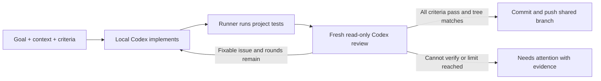

# Team Agent

**Give your team a shared workspace for local coding agents. Turn a goal into code, tests, and reviewable evidence.**

Team Agent is an open-source, self-hosted web app for teams using Codex. A teammate contributes an Agent by running a small process on their computer. Other team members can assign work from a browser, follow progress, inspect the changes, and request another improvement. Codex and Git credentials stay on the Agent owner's computer.

[**Try the browser demo**](https://boxzeemon-beep.github.io/team-agent/) · [**Set up real execution**](docs/getting-started.md) · [Workbench guide](docs/workbench.md) · [Report an issue](https://github.com/boxzeemon-beep/team-agent/issues)

[](https://github.com/boxzeemon-beep/team-agent/actions/workflows/ci.yml)
[](https://github.com/boxzeemon-beep/team-agent/actions/workflows/codeql.yml)
[](LICENSE)

## What can I do with it?

- **Describe an outcome.** Add project context, acceptance criteria, and a limit of one to three implementation/review rounds. Choose the Agent that should do the work.
- **Run real coding tasks.** The selected owner's Runner uses their local Codex, works in a managed Git clone, runs your project's test command, and pushes to a configured shared branch when its completion requirements are met.
- **Check the evidence.** Inspect per-criterion review results, earlier rounds, file-by-file diffs, raw test output, and the commit associated with a task.
- **Continue from feedback.** Turn a comment into a new editable goal with the earlier task as context. Export the recorded evidence as Markdown.
- **Recover work.** Task state persists in SQLite. Runner reconnection, retry, offline-Agent reassignment, and owner attention have explicit states and actions.

This is useful when a small team wants to share access to contributed coding agents and keep development work visible. Browser-only members do not install Codex or supply Git credentials. Agent owners remain responsible for the access and work performed on their machines.

## Demo or real execution?

| | Browser demo | Your own installation |
| --- | --- | --- |
| Start here | [Open the public demo](https://boxzeemon-beep.github.io/team-agent/) | [Follow the setup guide](docs/getting-started.md) |
| Install anything? | No | One Coordinator; one Runner per contributing Agent owner |
| Calls Codex? | No | Yes, on the selected Runner's computer |
| Edits or pushes code? | No | Yes, using that owner's existing Git permissions |
| Tests and review results | Fixed, clearly marked simulations | Actual project test output and recorded Codex review |
| Storage | This browser's local storage | Coordinator SQLite plus each Runner's local state |
| Can teammates use it together? | No shared server or real Agent pairing | Yes, with a reachable Coordinator and member invitations |

**GitHub Pages is an interactive demo, not a hosted coding service.** You cannot connect a real Runner to the public demo. Free-form requests in the demo do not generate real implementations. Its sample reviews, tests, and commits are simulated.

## What do I need to configure?

There are three roles. They can all run on one computer for a first trial, or on separate computers for a team.

| Role | What it runs | What you provide |
| --- | --- | --- |
| **Coordinator host** | Web app, API, task queue, SQLite | Node.js 22.13+ and pnpm 11 for a source installation, or Docker Compose with a source build; persistent storage; a URL reachable by your team |
| **Agent owner** | Runner, local Codex, managed Git clone | Node.js 22.13+, pnpm 11, Git, installed and signed-in Codex CLI, repository read/write access, project-specific build/test tools |
| **Team member** | Web browser | A member invitation and network access to the Coordinator |

The project administrator sets the repository URL, existing base branch, shared working branch, and test command. A test command is **required for verified goals**. Choose a command that can run on every contributing Runner host. If dependencies must be installed in a fresh clone, include that step in the command.

Team Agent does not create Codex accounts, supply model access, or configure Git authentication for you. Agent owners use their existing Codex access. Model usage is handled by that Codex account or configuration. The Runner must remain running, and its computer must stay awake and connected while it works.

## Start with a real local installation

The current workbench is distributed through **`main` source**. The published `v0.2.0` Docker images (`:0.2.0` and `:latest`) and latest Release Runner are older artifacts and do not include the new verified-goal protocol. Use the commands below or the [Docker source-build instructions](docs/getting-started.md#docker-source-build).

### 1. Start the Coordinator

Install Node.js 22.13+ and Git. Install the repository's pinned pnpm version if it is not already available, then build the source:

```sh
npm install --global pnpm@11.9.0
git clone https://github.com/boxzeemon-beep/team-agent.git
cd team-agent
pnpm install --frozen-lockfile
pnpm build
pnpm coordinator:built
```

Keep that terminal open. Follow the one-time administrator invitation printed in its output. The default local address is `http://127.0.0.1:4310`. Claiming the invitation creates your member identity and browser session; there is no preset username/password.

### 2. Configure your project

Click the project name to open project settings. For example:

| Setting | Example | Meaning |
| --- | --- | --- |
| Project name | `Acme Web` | Name shown to your team |
| Repository URL | `git@github.com:YOUR_ORG/YOUR_REPO.git` | A real repository each Runner owner can read and push to |
| Base branch | `main` | An existing branch to start from |
| Shared working branch | `team-agent/work` | Where Agent changes are committed and pushed; review this branch before merging |
| Test command | `pnpm install --frozen-lockfile && pnpm test` | Example for a pnpm project; replace it with your own reproducible checks |

Use a small repository and a dedicated working branch for your first task. Team Agent pushes commits to the shared branch; it does not automatically open a pull request, merge into a protected branch, or deploy your application.

### 3. Connect your local Agent

On the Agent owner's computer, install and sign in to Codex CLI and configure Git access to the target repository. Follow the [prerequisite checks](docs/getting-started.md#prerequisites) before pairing. That computer also needs this source checkout and its dependencies.

In the workbench, click **Connect Agent** and copy the generated pairing command. Run it from the Team Agent checkout in a second terminal. It has this form:

```sh
pnpm runner --coordinator "http://127.0.0.1:4310" --pair "YOUR_ONE_TIME_TOKEN" --name "Alex's Codex"
```

Use the generated URL and token, not these placeholders. When the Runner is on a different computer, use the Coordinator's reachable team URL instead of loopback. Keep this terminal open too. Wait for the Agent to appear online in the workbench. Subsequent starts use the same Coordinator and data directory without `--pair`.

### 4. Assign and review a task

Select your online Agent. Start with a small **Direct task** to confirm execution and Git access. Then try a **Verified goal** with concrete acceptance criteria, your real test command, and a two-round limit. Inspect the resulting diff, test output, review history, and commit before merging the shared branch.

For team access, invitations, HTTPS, PowerShell examples, owner approvals, restarts, backups, and troubleshooting, follow the [complete setup guide](docs/getting-started.md).

## How verified goals work



| Mode | Completion requirement |
| --- | --- |
| **Direct task** | Implementation, configured tests if present, and the existing commit/push workflow. It does not provide an independent per-criterion acceptance verdict. |
| **Verified goal** | A real configured test command succeeds; a fresh read-only review accounts for every agreed criterion with no unresolved issues; Git tree and HEAD checks confirm the reviewed code is the code being published. |

The review uses a separate Codex session on the **same selected Runner**, not a different person, machine, or guaranteed different model. Missing criteria, unknown verdicts, invalid review JSON, and changes to the reviewed tree cannot be treated as success. Each revision is tested and reviewed again.

“Publish” in task results means commit and push to your configured Git branch. Human review before merging remains your team's responsibility. See the [workbench guide](docs/workbench.md) for retry, recovery, feedback, and evidence details.

## Current scope and validation

The current implementation supports **one project per Coordinator, explicit Agent selection, Codex execution, and one active code task per project**. It does not provide parallel writable worktrees, automatic Agent routing, other model backends, scheduled cloud workers, or execution while the Runner host is asleep.

The published workbench passed 104 automated tests, source and Pages builds, and the Ubuntu/Windows × Node.js 22/24 CI matrix. The integration smoke test uses a mock Runner with real local Git; it does not call a model. A separate real-Codex attempt completed implementation and project tests, but its independent review timed out and the workflow correctly remained blocked without publishing. A full real-model acceptance-and-push run has **not yet been demonstrated**. The [validation record](docs/delivery.md) separates these results and links to evidence.

Treat this as an early self-hosted project. Confirm the complete workflow on your own small repository before relying on it for larger work.

## Where does my data go?

The Coordinator stores member identities, task context, conversations, diffs, test logs, review results, and project settings. The Runner keeps its device identity, Codex thread references, and managed clones on the owner's computer. Codex and Git credentials remain in that owner's existing local configuration. Project content is supplied to Codex as part of executing a task.

Invite people you trust with the project's development context and repository access. Use HTTPS and a private network or access-controlled reverse proxy for remote access. The browser cannot remotely grant owner-only execution approvals. Read the [security model](docs/security.md) for the trust boundaries and backup guidance.

## Documentation and development

- [Getting started](docs/getting-started.md): full installation, configuration, team deployment, and troubleshooting.
- [Workbench guide](docs/workbench.md): modes, sample walkthrough, evidence, retries, and feedback.
- [Architecture](docs/architecture.md): Coordinator, Runner, scheduling, and persistence.
- [Validation record](docs/delivery.md): automated, integration, browser, and real-model checks.
- [Research notes](docs/claude-team-research.md): source material and design decisions inspired by the Claude Code team.
- [Security](SECURITY.md), [Contributing](CONTRIBUTING.md), and [Roadmap](ROADMAP.md).

To run the browser simulation locally after installing dependencies:

```sh
pnpm demo:browser
```

Open `http://127.0.0.1:4321/team-agent/`. To check a source change:

```sh
pnpm lint
pnpm typecheck
pnpm test
pnpm demo:smoke
pnpm build
pnpm build:pages
```

Team Agent is [MIT licensed](LICENSE). Questions and ideas belong in [GitHub Discussions](https://github.com/boxzeemon-beep/team-agent/discussions); reproducible bugs belong in [Issues](https://github.com/boxzeemon-beep/team-agent/issues).
