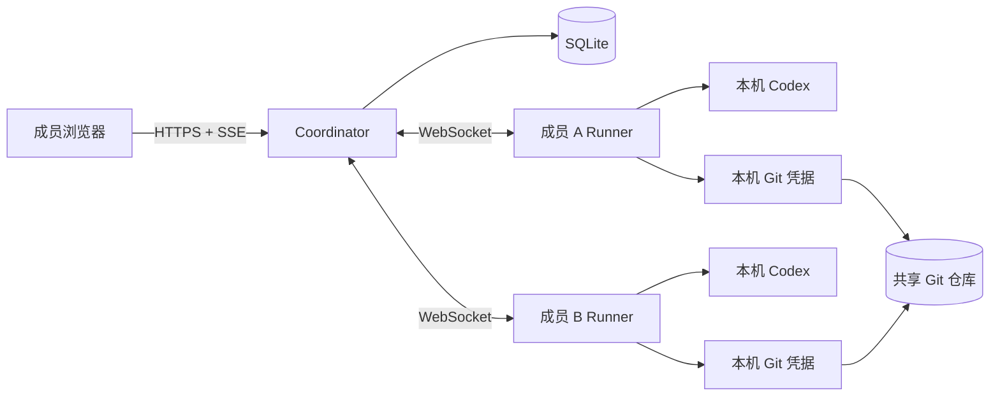

# Team Agent

**让团队共享 Coding Agent，而不共享账号和凭据。**


_画面来自隔离演示数据下的真实产品状态。_

[](https://github.com/boxzeemon-beep/team-agent/actions/workflows/ci.yml)
[](LICENSE)

[English](README.md) · [战术大厅体验](docs/tactical-lobby-experience.md) · [架构](docs/architecture.md) · [安全](SECURITY.md) · [路线图](ROADMAP.md) · [参与贡献](CONTRIBUTING.md)

Team Agent 让只有浏览器的成员，把开发任务交给其他成员贡献的 Codex Runner。Runner 在所有者的电脑上使用其已有的 Codex 和 Git 登录状态；Coordinator 保存团队共享对话、串行调度代码任务并记录执行结果。

```text
发起人输入任务
      ↓
明确选择一位队友的 Agent
      ↓
所有者的 Runner 使用本机 Codex 与 Git 身份
      ↓
团队查看进度、回复、diff、测试与 commit
```

Codex 登录信息和 Git 凭据始终留在 Runner 所有者的电脑上。

## 为什么使用 Team Agent

- **让每位成员都能参与。** 没有本地 Coding Agent 的成员只需打开网页。
- **凭据留在本机。** Runner 复用所有者已有的 Codex 与 Git 会话。
- **由发起人明确选择 Agent。** 目标 Agent 离线时任务会等待，也可重新指派。
- **共享项目上下文。** Runner 会收到该 Agent 上次参与之后新增的讨论与 commit。
- **执行结果可审计。** 已完成任务保留发起人、Agent 所有者、对话、diff、测试和 commit SHA。
- **串行处理 Agent 写入。** 项目级执行锁使两个 Team Agent 代码任务不会同时运行。

## 产品流程

1. Coordinator 主机创建项目并邀请成员。
2. Agent 所有者点击“贡献我的 Codex”，运行页面生成的一次性配对命令。
3. Runner 创建受管 Git 副本，并连接所有者电脑上的 Codex app-server。
4. 发起人输入任务，明确选择一位 Agent。
5. Coordinator 获取项目级执行锁，把最早可执行任务分配给目标 Runner。
6. Runner 更新共享分支，交给 Codex 执行，运行测试，创建 commit 并推送。
7. 网页实时展示进度，并保存回复、diff、测试结果与 commit。

Codex 原生审批仍由 Agent 所有者在本机处理；需要审批时，网页会显示“等待所有者”。

## 五分钟本地 Smoke Demo

从全新 checkout 开始，准备 Node.js 22.5+、Git，以及 pnpm 11 或 Corepack，即可先运行 Coordinator 与 Runner 协议的核心链路，再配置 Docker、远端 Git 仓库或 Codex：

```bash
./examples/smoke-demo/run.sh
```

Windows 用户可以运行 `powershell -ExecutionPolicy Bypass -File .\examples\smoke-demo\run.ps1`。该示例会启动真实的 Coordinator 与 SQLite，配对一个确定性的协议 Runner，分配任务，修改隔离的本地 Git 仓库，运行测试，推送共享分支，并核验保存的 diff、测试输出和 commit SHA。

预期输出以及这个免凭据 smoke test 与真实 Codex Runner 之间的边界，见[五分钟示例说明](docs/quickstart-demo.md)。

## 快速开始

### 环境要求

Coordinator 主机需要 Docker Compose、所有 Agent 所有者均可写入的 Git 仓库，以及团队可访问的 HTTPS 地址。当前文档使用 [Tailscale Serve](https://tailscale.com/docs/reference/tailscale-cli/serve) 提供私网入口。

Runner 主机还需要：

- 已安装并登录 Codex CLI；
- Node.js 22.5+ 与 npm，用于安装 Runner；
- 对项目 Git 仓库具有拉取和推送权限；
- 可以访问 Coordinator。

只使用网页的成员无需安装本地程序。

### 1. 启动 Coordinator

```bash
git clone https://github.com/boxzeemon-beep/team-agent.git
cd team-agent
cp .env.example .env
docker compose up -d
```

默认 Compose 配置会直接拉取已发布的 Coordinator 镜像
`ghcr.io/boxzeemon-beep/team-agent:0.1.0`，首次启动无需在本机编译源码。0.1.0 镜像发布平台为 `linux/amd64`，Apple 芯片上的 Docker Desktop 会使用模拟运行。选择其他已发布镜像或平台时，在 `.env` 中设置 `TEAM_AGENT_IMAGE` 和 `TEAM_AGENT_PLATFORM`。

在 `.env` 中把 `TEAM_AGENT_PUBLIC_URL` 设置为团队实际使用的 HTTPS 地址。Docker Compose 会发布 `4310` 端口，应通过私网或主机防火墙限制访问。使用 Tailscale Serve 时运行：

```bash
tailscale serve --bg 4310
tailscale serve status
```

修改 `.env` 后重启容器。通过 `docker compose logs coordinator` 查看第一个一次性管理员邀请；具名 Docker Volume 会在容器重启后保留 Coordinator 状态。

需要从当前 checkout 构建本地容器时，明确叠加开发 Compose 配置：

```bash
docker compose -f compose.yaml -f compose.dev.yaml up -d --build
```

不使用 Docker 的源码开发需要 Node.js 22.5+ 与 pnpm 11，可运行 `pnpm coordinator` 或 `pnpm coordinator:built`；源码进程默认监听 `127.0.0.1:4310`。

### 2. 配置项目

在浏览器领取管理员邀请，然后设置项目名称、Git 仓库地址、基础分支、共享工作分支和可选测试命令。接着为每位队友生成独立邀请。

### 3. 配对 Runner

Agent 所有者在项目页面点击“贡献我的 Codex”。页面会生成以下形式的一次性命令：

```bash
npx --yes --package=https://github.com/boxzeemon-beep/team-agent/releases/latest/download/team-agent-runner.tgz \
  team-agent runner --coordinator "https://COORDINATOR.example" --pair "PAIRING_TOKEN" --name "张三的 Codex"
```

该命令直接运行最新 GitHub Release 产物，不依赖 npm 包已经发布。需要长期使用全局命令时，可运行 `scripts/runner-install.sh` 或 `scripts/runner-install.ps1`，再通过 `team-agent doctor --coordinator "https://COORDINATOR.example"` 检查主机环境。从源码开发的贡献者也可通过 `pnpm runner -- ...` 使用相同参数。

配对 token 只使用一次。默认情况下，Runner 把设备身份、Codex Thread ID 和受管副本保存在 `~/.team-agent/runner/`。后续使用相同 Coordinator、名称和数据目录重启，并省略 `--pair`。

## 架构



```text
apps/coordinator/   Fastify API、SQLite、SSE、Runner WebSocket、React 网页
apps/runner/        Codex app-server 客户端、受管 Git 副本、测试、提交与推送
packages/shared/    Coordinator、网页和 Runner 共享的类型与协议
```

调度、上下文与故障恢复机制详见[架构文档](docs/architecture.md)。

## 安全边界

- Codex 与 Git 凭据留在每位 Runner 所有者的电脑上。
- 浏览器会话、邀请与 Runner 配对凭据在服务端保存为 SHA-256 摘要。
- Session Cookie 使用 `HttpOnly` 和 `SameSite=Strict`，HTTPS 部署同时使用 `Secure`。
- 配对 token 短期有效且只使用一次。
- Tailscale ACL 控制谁能访问 Coordinator，项目邀请控制谁能进入应用。
- 贡献的 Agent 会使用所有者的 Git 权限修改并推送配置的共享分支。应只邀请信任的成员，并由项目负责人审查后合并到受保护分支。

漏洞报告方式见[安全策略](SECURITY.md)，完整部署检查清单见[安全模型](docs/security.md)。

## 支持矩阵

| 能力 | 当前状态 |
| --- | --- |
| Coding Agent | Codex first；Adapter 生态在路线图中 |
| 每个 Coordinator 的项目数 | 一个 |
| 活动代码任务 | 每个项目一个，串行执行 |
| Agent 选择 | 发起人明确选择 |
| 离线 Agent | 任务等待，可重新指派 |
| Git 工作流 | 一个可配置的共享工作分支 |
| 所有者审批 | 在所有者本机 Codex 会话中处理 |
| Coordinator 状态 | 本地 SQLite，可在重启后恢复 |
| Runner 状态 | 本机保存设备 token、Codex Thread、受管副本和完成回执 |
| 网络入口 | 源码进程默认仅回环地址；Compose 发布可配置的 `4310` 端口 |

## 当前范围

当前版本聚焦一个项目、Codex 和串行执行。自动 Agent 路由、并行 worktree、多项目、更多 Coding Agent 与托管云基础设施属于后续路线图。

## 路线图

近期优先级：

1. 可重复的纯净主机安装流程，以及升级、备份和回滚指南；
2. 使用真实 Codex 的五分钟首任务教程与示例仓库；
3. Agent Adapter 接口和第二种 Coding Agent；
4. 多项目、隔离并行 worktree 与网页审批。

完整计划见[公开路线图](ROADMAP.md)，详细发布门槛见 [`docs/roadmap.md`](docs/roadmap.md)。欢迎在 [GitHub Discussions](https://github.com/boxzeemon-beep/team-agent/discussions) 提交产品建议，也欢迎通过 Issue 和 Pull Request 参与实现。

## 开发

```bash
corepack enable
pnpm install --frozen-lockfile
pnpm coordinator:dev

pnpm exec biome check .
pnpm typecheck
pnpm test
pnpm build
```

自动化测试覆盖邀请与 Cookie、Runner 配对、串行调度、跳过离线 Agent、结果持久化与 SQLite 重启恢复。参与开发前请阅读 [CONTRIBUTING.md](CONTRIBUTING.md)。

## 加入首批 20 个设计伙伴团队

我们正在招募 20 个团队，用 Team Agent 尝试一个边界清晰的开发任务，并共同确定后续版本的优先级。

- 如果团队可以完成一个边界清晰的任务并提供产品反馈，请[申请成为设计伙伴](https://github.com/boxzeemon-beep/team-agent/issues/new?template=design_partner.yml)。申请内容会成为公开 Issue，请只填写脱敏信息。
- 如果已经开始使用 Team Agent，请[分享一份脱敏工作流](https://github.com/boxzeemon-beep/team-agent/issues/new?template=workflow_story.yml)。
- 安装问题和产品想法可以发布到 [GitHub Discussions](https://github.com/boxzeemon-beep/team-agent/discussions)。

## 开源协议

[MIT](LICENSE)
