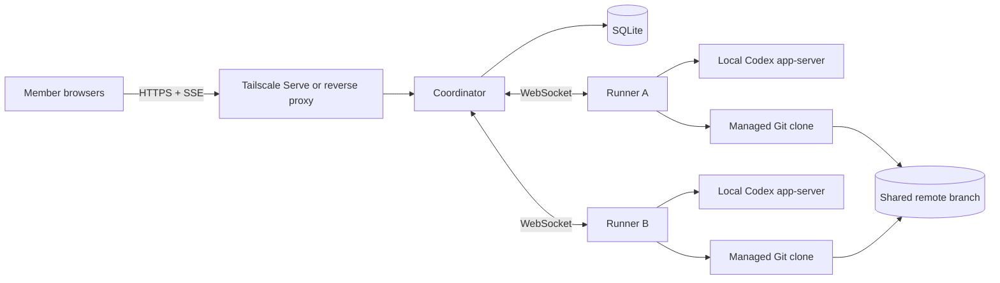

# Architecture

Team Agent is a TypeScript monorepo with two long-running processes, one shared protocol package, a SQLite database, and a shared Git working branch.

## Components



### Coordinator

The Coordinator owns invitations, browser sessions, project settings, shared conversation history, the task queue, the project-wide execution lock, the web/API surfaces, and durable SQLite state. It has no Codex login or Git credential. It defaults to `127.0.0.1:4310` and relies on a private HTTPS route such as Tailscale Serve for team access.

### Runner

Each Agent owner runs a Runner on their own computer. It owns a persistent device token and Agent identity, a local Codex thread per project, a managed Git clone, test/commit/push execution, and a bounded cache of completion receipts. The Runner connects outbound to the Coordinator and uses the owner's existing local Codex and Git sessions.

### Shared protocol

`packages/shared` defines the HTTP payloads and Runner protocol used by the Coordinator, web app, and Runner. Runner messages cover registration, heartbeat, assignment, progress, owner-waiting, completion, and attention-needed events.

## Consistency model

1. SQLite is the source of truth for members, Agents, settings, tasks, messages, and the active assignment.
2. The configured shared Git branch is the source of truth for code state.
3. A task in `running` or `waiting_for_owner` holds the durable project-wide execution lock.
4. The scheduler chooses the earliest runnable task and skips work targeted at an offline or paused Agent.
5. Before work, a Runner fetches and resets its managed clone to the latest shared branch state.
6. After work, it runs the configured tests, commits, pushes, and only then reports completion.
7. Every Agent has a context cursor. An assignment contains shared project messages added since that Agent last participated, plus the current task conversation and preceding results.

The current release intentionally serializes all code tasks for its single project. This avoids merge races while a team uses the shared-Agent workflow.

## Task lifecycle

```text
queued
  ├── selected Agent unavailable → waiting_for_agent
  └── assignment dispatched       → running
                                      ├── local approval → waiting_for_owner
                                      ├── success        → completed
                                      └── test/Git issue → needs_attention

queued or waiting tasks may also be reassigned or canceled.
```

An offline waiting task keeps its selected Agent but does not block runnable tasks for online Agents. An active task whose Runner disconnects keeps the lock and its assignment so the same Runner can resume safely.

## Recovery model

### Coordinator restart

Members, sessions, settings, tasks, messages, Agent context cursors, and the active lock are persisted in SQLite. Starting with the same `TEAM_AGENT_DATA_DIR` reconstructs the queue. A reconnecting Runner receives the saved assignment.

### Runner restart

The Runner persists its device ID, device token, Agent ID, project thread IDs, last task IDs, and recent completion receipts. It also protects its data directory with a process lock. Starting with the same data directory restores its identity and managed clones.

### Test or Git failure

The task enters `needs_attention`, diagnostic output and local work are preserved, and the Agent is paused. The owner can inspect the managed clone, retry after resolving the issue, or explicitly reset a managed project with `--reset-managed PROJECT_KEY`.

### Disconnected active Runner

The default is to retain the lock. An administrator-only emergency release is available after the team has confirmed that the owner's Runner process has stopped. It moves the task to `needs_attention`, preserves its assignment, pauses the Agent, records a system message, and then allows the scheduler to continue.

## Persistence and backup

- Coordinator data defaults to `.data/coordinator`; use a stable absolute `TEAM_AGENT_DATA_DIR` for a persistent deployment.
- SQLite uses WAL mode, so a consistent backup requires stopping the Coordinator and copying the entire data directory, including database, WAL, SHM, and persisted server keys.
- A custom Runner `--data-dir` must be reused for every start and reset command.
- Do not run two Runner processes against the same data directory.

## Current design boundaries

| Area | Current choice |
| --- | --- |
| Projects | One project per Coordinator |
| Coding agents | Codex first |
| Scheduling | Explicit Agent selection; one active code task |
| Git | One configurable shared working branch |
| Context | Shared SQLite conversation plus per-Agent Codex thread |
| Approval | Agent owner handles native Codex approval locally |
| Deployment | Self-hosted Coordinator and owner-hosted Runners |

Multi-project operation, parallel isolated worktrees, automatic routing, additional Agent adapters, and managed cloud infrastructure are tracked in the [roadmap](roadmap.md).
